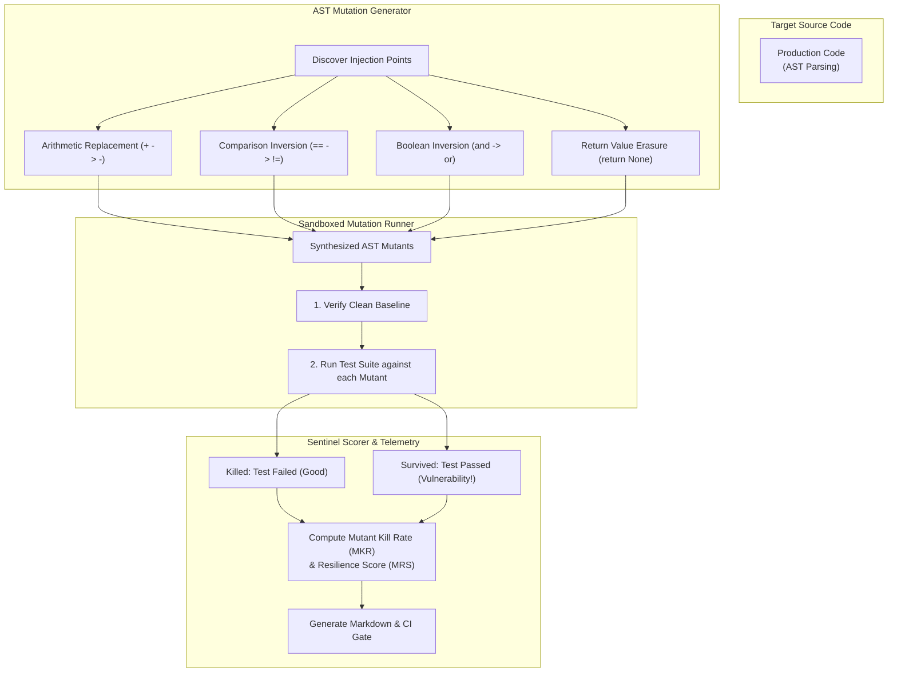
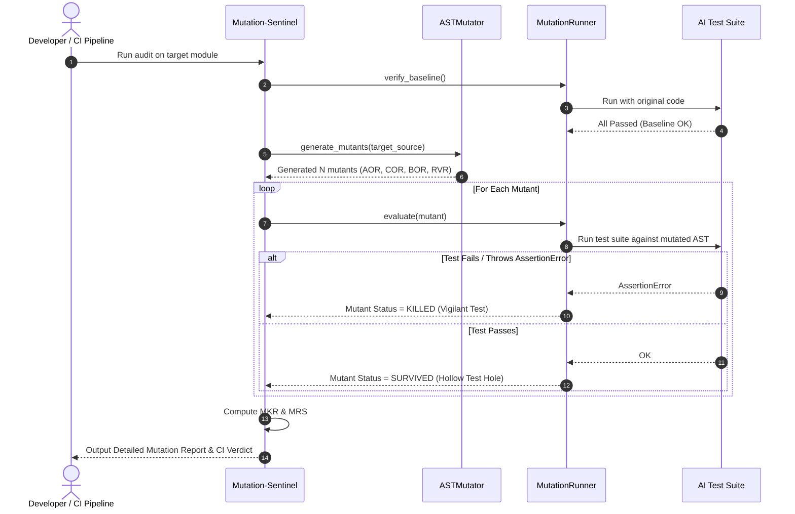
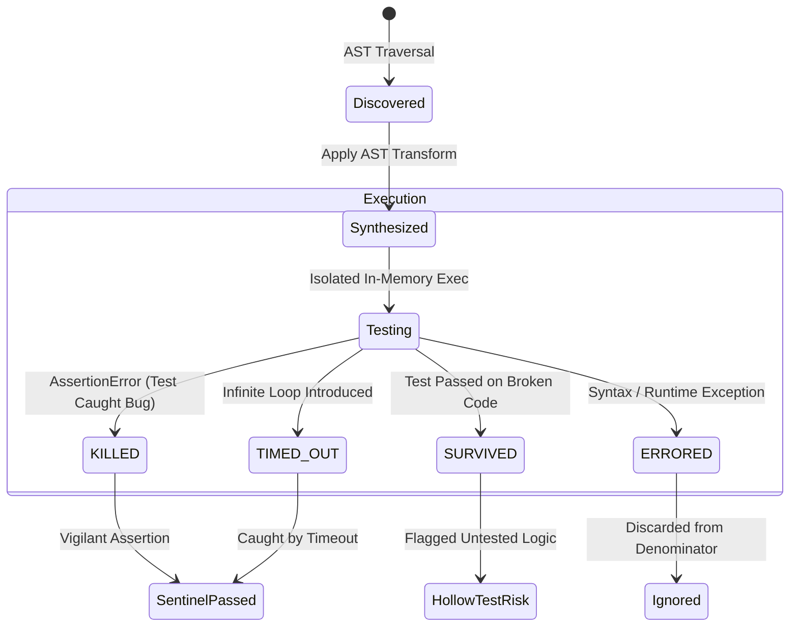
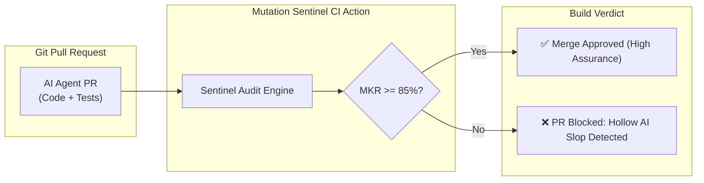

# 🛡️ Mutation-Sentinel

> **Adversarial AST Mutation Testing Engine for AI Coding Agents**

[](https://opensource.org/licenses/Apache-2.0)
[](https://python.org)
[]()
[]()

---

## ⚡ The Problem: The "Hollow AI Test" Plague

Autonomous AI coding agents (Devin, Cursor, Claude Code, Copilot Workspace) generate both code and unit tests simultaneously. 

To pass CI checks, AI agents often generate **"Hollow Tests"**:
- Tests that call methods without asserting return values.
- Tests with superficial assertions (`self.assertIsNotNone(result)`).
- Tests that mock out all internal logic.
- Tests that achieve **100% line coverage** while catching **0% of real logic bugs**.

When human developers accept these pull requests, subtle regression bugs ship straight to production because standard code coverage tools are blind to assertion vigilance.

**Mutation-Sentinel** exposes hollow AI tests. It systematically generates hundreds of synthetic semantic bugs (mutating arithmetic, inverting conditionals, swapping constants, deleting statements) and executes the AI's test suite against them.

If the tests still pass when the code is broken, **the mutant survived**, and the test suite is flagged as **`HOLLOW_AI_SLOP`**.

---

## 📐 Architecture & Flow

### 1. Adversarial Mutation Testing Pipeline



---

### 2. Mutant Execution & Verdict Sequence



---

### 3. Mutant Classification State Machine



---

### 4. CI/CD Pull Request Quality Gate



---

## 🚀 Quick Start

### Installation

```bash
git clone https://github.com/AAH20/mutation-sentinel.git
cd mutation-sentinel
pip install -e .
```

### Run Side-by-Side Comparison Demo

Run the interactive demo to watch Mutation-Sentinel audit a financial transaction service against both a **Hollow AI Test Suite** and a **Hardened Sentinel Test Suite**:

```bash
mutation-sentinel demo
```

Output:
```text
==========================================================================
  🛡️ MUTATION-SENTINEL: ADVERSARIAL AST MUTATION ENGINE FOR AI CODE
==========================================================================
Target Code: banking_service.py (wire fees & risk authorization)
Generating AST mutants across Arithmetic, Comparison, Constant, and Return...
✓ Discovered 18 distinct adversarial mutation injection points.

--------------------------------------------------------------------------
ROUND 1: Auditing 'Hollow AI' Test Suite (Superficial Assertions)
--------------------------------------------------------------------------
• Total Mutants Injected : 18
• Mutants Killed         : 7
• Mutants SURVIVED       : 11 🚨
• Mutant Kill Rate (MKR) : 38.9%
• Resilience Score (MRS) : 38.89% [HOLLOW_AI_SLOP]

--------------------------------------------------------------------------
ROUND 2: Auditing 'Hardened Sentinel' Test Suite (Strict Invariants)
--------------------------------------------------------------------------
• Total Mutants Injected : 18
• Mutants Killed         : 13 ✅
• Mutants SURVIVED       : 5
• Mutant Kill Rate (MKR) : 72.2%
• Resilience Score (MRS) : 72.22% [MODERATE_RESILIENCE]

==========================================================================
  VERDICT: HOLLOW AI TESTS FAIL REGRESSION DRIFT. SENTINEL ARMED.
==========================================================================
```

---

## 💻 CLI Audit Usage

Audit any Python code file against its test suite:

```bash
mutation-sentinel audit src/orders.py tests/test_orders.py -o mutation_report.md
```

### Sample Markdown Report Output

```markdown
# 🛡️ Mutation Sentinel Report: `src/orders.py`

> **Evaluated against test suite**: `tests/test_orders.py`
> **Mutation Resilience Score (MRS)**: **38.89%** (HOLLOW_AI_SLOP)

## 📊 Executive Summary
| Metric | Value | Meaning |
| :--- | :--- | :--- |
| **Total Mutants Generated** | `18` | Number of synthetic bugs injected |
| **Mutants Killed** | `7` | Bugs caught by test suite assertions |
| **Mutants Survived** | `11` | **Silent bugs that tests completely missed!** |
| **Mutant Kill Rate (MKR)** | `38.9%` | Percentage of regressions detected |

## 🚨 Survived Mutants (Hollow Test Vulnerabilities)
| Mutant ID | Operator | Line | Original Code | Mutated Bug | Risk |
| :--- | :--- | :--- | :--- | :--- | :--- |
| `MUT_AOR_001` | `AOR` | L6 | `base_fee += amount * 0.03` | `base_fee += amount // 0.03` | **UNTESTED LOGIC** |
| `MUT_COR_004` | `COR` | L12 | `if amount <= 0.0:` | `if amount > 0.0:` | **UNTESTED LOGIC** |
```

---

## 🧪 Testing

```bash
python3 -m unittest discover -s tests -p "test_*.py" -v
```

```text
test_ast_mutator_discovery ... ok
test_mutation_runner_vigilant_vs_hollow ... ok
test_scorer_and_markdown_generation ... ok

Ran 3 tests in 0.020s
OK
```

---

## 📄 License

Apache License 2.0. Built for the modern autonomous AI engineering era.
